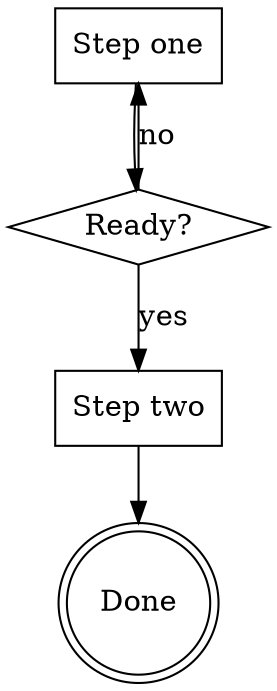
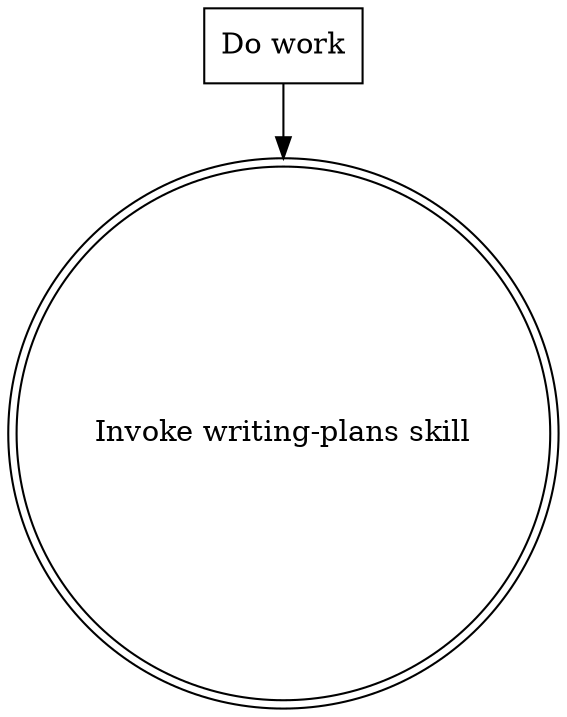

# Skill Workflow Engine Implementation Plan

> **For agentic workers:** REQUIRED SUB-SKILL: Use superpowers:subagent-driven-development (recommended) or superpowers:executing-plans to implement this plan task-by-task. Steps use checkbox (`- [ ]`) syntax for tracking.

**Goal:** Compile superpowers-style skill markdown into executable graph structures, unify agent communication with structured message protocol, and enhance graph engine with parallel execution and conditional edges.

**Architecture:** Bottom-up implementation starting from Layer 0 data models (messages, workflow types, new node types), then adapting existing code (AgentResult, Runner, Engine) to the new protocol, then building new features (SkillParser, WorkflowCompiler, parallel delegate), and finally wiring integration at the app layer.

**Tech Stack:** Python 3.13, asyncio, dataclasses, Pydantic BaseModel, regex (for markdown/dot parsing), uuid

---

## File Map

### New files

| File | Responsibility |
|------|---------------|
| `src/graph/messages.py` | AgentMessage, AgentResponse, ResponseStatus, format_for_receiver, build_message_schema |
| `src/graph/workflow.py` | StepType, WorkflowStep, WorkflowTransition, WorkflowPlan |
| `src/graph/nodes.py` | DecisionNode, SubgraphNode, TerminalNode |
| `src/skills/workflow_parser.py` | SkillWorkflowParser — parses skill markdown into WorkflowPlan |
| `src/skills/compiler.py` | WorkflowCompiler — compiles WorkflowPlan into CompiledGraph |
| `tests/graph/test_messages.py` | Tests for AgentMessage, AgentResponse, format_for_receiver, build_message_schema |
| `tests/graph/test_workflow.py` | Tests for WorkflowPlan models |
| `tests/graph/test_nodes.py` | Tests for DecisionNode, SubgraphNode, TerminalNode |
| `tests/skills/test_workflow_parser.py` | Tests for SkillWorkflowParser |
| `tests/skills/test_compiler.py` | Tests for WorkflowCompiler |

### Modified files

| File | Changes |
|------|---------|
| `src/graph/types.py:44-49` | Edge: rename `source`→`from_node`, `target`→`to_node`, add `condition: str \| None` field, remove callable condition |
| `src/graph/engine.py:49-175` | `_resolve_edges` supports string condition matching; parallel node execution via `asyncio.gather`; depth limit checks; `_merge_parallel_outputs`; write `_last_output` to state |
| `src/graph/builder.py:41` | `add_edge` signature adapts to new Edge fields |
| `src/graph/__init__.py` | Export new types |
| `src/agents/agent.py:11-25` | HandoffRequest uses AgentMessage; AgentResult uses AgentResponse |
| `src/agents/context.py:46-61` | RunContext.input type annotation updated; add `current_agent` field |
| `src/agents/runner.py:109-130,229-253` | Handoff tool builds AgentMessage; _build_handoff_tools uses build_message_schema |
| `src/agents/node.py:17-25` | AgentNode.execute returns AgentResponse in NodeResult |
| `src/tools/delegate.py` | Rewrite to use AgentMessage, go through engine, add parallel_delegate |
| `src/skills/parser.py` | No changes (workflow parsing goes in new file) |
| `src/app/app.py:101-136` | `_handle_skill` uses SkillWorkflowParser + WorkflowCompiler |
| `config.yaml` | Add depth limit settings under `agents:` |

---

### Task 1: Structured Message Protocol — AgentMessage & AgentResponse

**Files:**
- Create: `src/graph/messages.py`
- Test: `tests/graph/test_messages.py`

- [ ] **Step 1: Write the failing tests**

```python
# tests/graph/test_messages.py
import json
import pytest
from src.graph.messages import (
    AgentMessage,
    AgentResponse,
    ResponseStatus,
    format_for_receiver,
    build_message_schema,
)


class TestAgentMessage:
    def test_required_fields(self):
        msg = AgentMessage(objective="部署应用", task="检查服务器状态")
        assert msg.objective == "部署应用"
        assert msg.task == "检查服务器状态"
        assert msg.context == ""
        assert msg.expected_result is None
        assert msg.sender is None
        assert len(msg.message_id) == 12

    def test_all_fields(self):
        msg = AgentMessage(
            objective="部署应用",
            task="检查服务器状态",
            context={"server": "prod-01"},
            expected_result="返回服务器 CPU 和内存使用率",
            sender="orchestrator",
        )
        assert msg.context == {"server": "prod-01"}
        assert msg.expected_result == "返回服务器 CPU 和内存使用率"
        assert msg.sender == "orchestrator"

    def test_message_id_unique(self):
        msg1 = AgentMessage(objective="a", task="b")
        msg2 = AgentMessage(objective="a", task="b")
        assert msg1.message_id != msg2.message_id

    def test_context_accepts_string(self):
        msg = AgentMessage(objective="a", task="b", context="一些上下文")
        assert msg.context == "一些上下文"


class TestAgentResponse:
    def test_defaults(self):
        resp = AgentResponse(text="完成")
        assert resp.status == ResponseStatus.COMPLETED
        assert resp.data == {}
        assert resp.sender is None
        assert resp.message_id == ""

    def test_with_message_id(self):
        resp = AgentResponse(text="ok", message_id="abc123")
        assert resp.message_id == "abc123"

    def test_from_graph_result_with_agent_response(self):
        original = AgentResponse(text="hello", data={"k": "v"}, message_id="id1")
        result_mock = type("GR", (), {"output": original})()
        converted = AgentResponse.from_graph_result(result_mock)
        assert converted is original

    def test_from_graph_result_with_dict(self):
        result_mock = type("GR", (), {"output": {"text": "hi", "data": {"a": 1}}})()
        converted = AgentResponse.from_graph_result(result_mock)
        assert converted.text == "hi"
        assert converted.data == {"a": 1}

    def test_from_graph_result_with_empty_dict(self):
        result_mock = type("GR", (), {"output": {}})()
        converted = AgentResponse.from_graph_result(result_mock)
        assert converted.text == ""
        assert converted.data == {}


class TestFormatForReceiver:
    def test_all_fields(self):
        msg = AgentMessage(
            objective="部署应用",
            task="检查服务器状态",
            context="生产环境",
            expected_result="CPU 和内存",
        )
        text = format_for_receiver(msg)
        assert "最终目标：部署应用" in text
        assert "具体任务：检查服务器状态" in text
        assert "相关上下文：生产环境" in text
        assert "期望结果：CPU 和内存" in text

    def test_optional_fields_omitted(self):
        msg = AgentMessage(objective="a", task="b")
        text = format_for_receiver(msg)
        assert "相关上下文" not in text
        assert "期望结果" not in text

    def test_dict_context_serialized(self):
        msg = AgentMessage(objective="a", task="b", context={"key": "val"})
        text = format_for_receiver(msg)
        assert '"key"' in text
        assert '"val"' in text


class TestBuildMessageSchema:
    def test_schema_structure(self):
        schema = build_message_schema()
        assert schema["type"] == "object"
        props = schema["properties"]
        assert "objective" in props
        assert "task" in props
        assert "context" in props
        assert "expected_result" in props
        assert schema["required"] == ["objective", "task"]

    def test_all_properties_are_strings(self):
        schema = build_message_schema()
        for prop in schema["properties"].values():
            assert prop["type"] == "string"
```

- [ ] **Step 2: Run tests to verify they fail**

Run: `uv run pytest tests/graph/test_messages.py -v`
Expected: FAIL — `ModuleNotFoundError: No module named 'src.graph.messages'`

- [ ] **Step 3: Implement messages.py**

```python
# src/graph/messages.py
"""agent 间通信的统一结构化消息协议。

AgentMessage 强制发送方回答 WHY/WHAT/WITH/EXPECT 四个维度，
AgentResponse 统一返回格式。message_id 用于关联请求与响应。
"""
from __future__ import annotations

import json
import uuid
from dataclasses import dataclass, field
from enum import Enum
from typing import Any


class ResponseStatus(Enum):
    """agent 响应状态。"""
    COMPLETED = "completed"
    FAILED = "failed"
    NEEDS_INPUT = "needs_input"


@dataclass
class AgentMessage:
    """agent 间通信的统一输入。"""
    objective: str
    task: str
    context: dict[str, Any] | str = ""
    expected_result: str | None = None
    sender: str | None = None
    message_id: str = field(default_factory=lambda: uuid.uuid4().hex[:12])


@dataclass
class AgentResponse:
    """agent 间通信的统一输出。"""
    text: str
    data: dict[str, Any] = field(default_factory=dict)
    status: ResponseStatus = ResponseStatus.COMPLETED
    sender: str | None = None
    message_id: str = ""

    @classmethod
    def from_graph_result(cls, result: Any) -> AgentResponse:
        """从 GraphResult 构造 AgentResponse，兼容旧 dict 格式。"""
        output = result.output
        if isinstance(output, AgentResponse):
            return output
        if isinstance(output, dict):
            return cls(
                text=output.get("text", ""),
                data=output.get("data", {}),
            )
        return cls(text=str(output))


RECEIVING_TEMPLATE = (
    "你收到了一个委托任务：\n"
    "最终目标：{objective}\n"
    "具体任务：{task}\n"
    "{context_line}"
    "{expected_result_line}"
    "\n"
    "完成后请按以下格式返回：\n"
    "第一行标注任务状态：已完成 / 信息不足 / 失败\n"
    "之后是具体结果或需要补充的信息。\n"
    "不要猜测或假设缺失的信息。"
)


def format_for_receiver(message: AgentMessage) -> str:
    """将 AgentMessage 格式化为接收方的 prompt 输入。"""
    context_line = ""
    if message.context:
        ctx = (
            message.context
            if isinstance(message.context, str)
            else json.dumps(message.context, ensure_ascii=False)
        )
        context_line = f"相关上下文：{ctx}\n"
    expected_line = (
        f"期望结果：{message.expected_result}\n"
        if message.expected_result
        else ""
    )
    return RECEIVING_TEMPLATE.format(
        objective=message.objective,
        task=message.task,
        context_line=context_line,
        expected_result_line=expected_line,
    )


def build_message_schema() -> dict:
    """生成 AgentMessage 对应的 JSON Schema，供工具 schema 复用。"""
    return {
        "type": "object",
        "properties": {
            "objective": {
                "type": "string",
                "description": "你的最终目标是什么（为什么需要这次协作）",
            },
            "task": {
                "type": "string",
                "description": "你需要对方具体做什么",
            },
            "context": {
                "type": "string",
                "description": "当前已知的相关信息。只填你确定知道的，不要猜测。",
            },
            "expected_result": {
                "type": "string",
                "description": "你期望对方完成后告诉你什么。如果不确定，可简要描述即可。",
            },
        },
        "required": ["objective", "task"],
    }
```

- [ ] **Step 4: Run tests to verify they pass**

Run: `uv run pytest tests/graph/test_messages.py -v`
Expected: ALL PASS

- [ ] **Step 5: Update `src/graph/__init__.py` to export new types**

Add to imports and `__all__`:
```python
from src.graph.messages import AgentMessage, AgentResponse, ResponseStatus, format_for_receiver, build_message_schema
```

- [ ] **Step 6: Commit**

```bash
git add src/graph/messages.py src/graph/__init__.py tests/graph/test_messages.py
git commit -m "feat(graph): add structured message protocol — AgentMessage, AgentResponse"
```

---

### Task 2: Workflow Data Models

**Files:**
- Create: `src/graph/workflow.py`
- Test: `tests/graph/test_workflow.py`

- [ ] **Step 1: Write the failing tests**

```python
# tests/graph/test_workflow.py
import pytest
from src.graph.workflow import StepType, WorkflowStep, WorkflowTransition, WorkflowPlan


class TestWorkflowStep:
    def test_action_step(self):
        step = WorkflowStep(
            id="s1", name="Explore", instructions="Look at files",
            step_type=StepType.ACTION,
        )
        assert step.step_type == StepType.ACTION
        assert step.subworkflow_skill is None

    def test_subworkflow_step(self):
        step = WorkflowStep(
            id="s2", name="Invoke plans", instructions="",
            step_type=StepType.SUBWORKFLOW, subworkflow_skill="writing-plans",
        )
        assert step.subworkflow_skill == "writing-plans"


class TestWorkflowTransition:
    def test_unconditional(self):
        t = WorkflowTransition(from_step="a", to_step="b")
        assert t.condition is None

    def test_conditional(self):
        t = WorkflowTransition(from_step="a", to_step="b", condition="yes")
        assert t.condition == "yes"


class TestWorkflowPlan:
    def test_minimal_plan(self):
        step = WorkflowStep(id="main", name="Main", instructions="do it",
                            step_type=StepType.ACTION)
        plan = WorkflowPlan(name="test", steps=[step], transitions=[],
                            entry_step="main", constraints=[])
        assert plan.entry_step == "main"
        assert len(plan.steps) == 1

    def test_plan_with_constraints(self):
        step = WorkflowStep(id="s1", name="S1", instructions="",
                            step_type=StepType.ACTION)
        plan = WorkflowPlan(
            name="test", steps=[step], transitions=[],
            entry_step="s1", constraints=["No placeholders", "TDD always"],
        )
        assert len(plan.constraints) == 2
```

- [ ] **Step 2: Run tests to verify they fail**

Run: `uv run pytest tests/graph/test_workflow.py -v`
Expected: FAIL — `ModuleNotFoundError: No module named 'src.graph.workflow'`

- [ ] **Step 3: Implement workflow.py**

```python
# src/graph/workflow.py
"""Skill 工作流的中间表示模型。

SkillWorkflowParser 将 markdown 解析为 WorkflowPlan，
WorkflowCompiler 将 WorkflowPlan 编译为 CompiledGraph。
"""
from __future__ import annotations

from dataclasses import dataclass, field
from enum import Enum


class StepType(Enum):
    """工作流步骤类型，对应 dot graph 中的 shape。"""
    ACTION = "action"
    DECISION = "decision"
    TERMINAL = "terminal"
    SUBWORKFLOW = "subworkflow"


@dataclass
class WorkflowStep:
    """工作流的一个步骤。"""
    id: str
    name: str
    instructions: str
    step_type: StepType
    subworkflow_skill: str | None = None


@dataclass
class WorkflowTransition:
    """步骤间的转换，可带条件标签。"""
    from_step: str
    to_step: str
    condition: str | None = None


@dataclass
class WorkflowPlan:
    """从 skill markdown 解析出的完整工作流。"""
    name: str
    steps: list[WorkflowStep]
    transitions: list[WorkflowTransition]
    entry_step: str
    constraints: list[str] = field(default_factory=list)
```

- [ ] **Step 4: Run tests to verify they pass**

Run: `uv run pytest tests/graph/test_workflow.py -v`
Expected: ALL PASS

- [ ] **Step 5: Update `src/graph/__init__.py` to export new types**

Add to imports and `__all__`:
```python
from src.graph.workflow import StepType, WorkflowStep, WorkflowTransition, WorkflowPlan
```

- [ ] **Step 6: Commit**

```bash
git add src/graph/workflow.py src/graph/__init__.py tests/graph/test_workflow.py
git commit -m "feat(graph): add workflow data models — WorkflowPlan, WorkflowStep"
```

---

### Task 3: Edge Condition Field & Builder Adaptation

**Files:**
- Modify: `src/graph/types.py:44-49`
- Modify: `src/graph/builder.py:41`
- Modify: `src/graph/engine.py:143-152`
- Test: `tests/graph/test_builder.py` (update existing)
- Test: `tests/graph/test_engine.py` (update existing)

This task changes `Edge` to use string field names matching the spec (`from_node`/`to_node`) and a string `condition` instead of a callable.

- [ ] **Step 1: Update Edge dataclass in types.py**

Replace `Edge` (lines 44-49) with:

```python
@dataclass
class Edge:
    from_node: str
    to_node: str
    condition: Optional[str] = None
```

- [ ] **Step 2: Update GraphBuilder.add_edge in builder.py**

Replace the `add_edge` method (line 41) with:

```python
    def add_edge(
        self, source: str, target: str, condition: str | None = None,
    ) -> GraphBuilder:
        """Add a directed edge. source/target are node names."""
        self._edges.append(Edge(from_node=source, to_node=target, condition=condition))
        return self
```

Update the `compile` method's edge validation (around line 67-70) to reference `edge.from_node` and `edge.to_node` instead of `edge.source` and `edge.target`.

- [ ] **Step 3: Update GraphEngine._resolve_edges in engine.py**

Replace `_resolve_edges` (lines 143-152) with:

```python
    def _resolve_edges(
        self, source: str, node_result: NodeResult,
        graph: CompiledGraph, context: Any,
    ) -> list[str]:
        candidates = [e for e in graph.edges if e.from_node == source]
        if not candidates:
            return []

        unconditional = [e for e in candidates if e.condition is None]
        conditional = [e for e in candidates if e.condition is not None]

        if conditional:
            chosen_branch = ""
            if isinstance(node_result.output, dict):
                chosen_branch = node_result.output.get("chosen_branch", "")
            elif hasattr(node_result.output, "data"):
                chosen_branch = node_result.output.data.get("chosen_branch", "")
            matched = [e for e in conditional if e.condition == chosen_branch]
            if not matched:
                logger.warning(
                    "No exact branch match for '%s', using first conditional edge",
                    chosen_branch,
                )
                matched = [conditional[0]]
            return [e.to_node for e in matched]

        return [e.to_node for e in unconditional]
```

Update the call site in `run()` (around line 107) to pass `node_result` to `_resolve_edges`.

- [ ] **Step 4: Fix all existing tests that reference edge.source / edge.target or callable conditions**

In `tests/graph/test_engine.py`, the `test_conditional_edge` test (line 135) uses a callable condition:

```python
# Change from callable to string condition:
builder.add_edge("start", "branch_a", condition="go_a")
builder.add_edge("start", "branch_b")
```

Update `test_conditional_edge` to make the start node return output with `chosen_branch` matching the condition string.

In `tests/graph/test_builder.py`, update any references to `edge.source`/`edge.target` to `edge.from_node`/`edge.to_node`.

- [ ] **Step 5: Run all graph tests to verify they pass**

Run: `uv run pytest tests/graph/ -v`
Expected: ALL PASS

- [ ] **Step 6: Commit**

```bash
git add src/graph/types.py src/graph/builder.py src/graph/engine.py tests/graph/
git commit -m "refactor(graph): Edge uses string condition, rename source→from_node/target→to_node"
```

---

### Task 4: New Node Types — DecisionNode, SubgraphNode, TerminalNode

**Files:**
- Create: `src/graph/nodes.py`
- Test: `tests/graph/test_nodes.py`

- [ ] **Step 1: Write the failing tests**

```python
# tests/graph/test_nodes.py
import pytest
from unittest.mock import AsyncMock, MagicMock
from dataclasses import dataclass, field
from pydantic import BaseModel, ConfigDict

from src.graph.nodes import DecisionNode, SubgraphNode, TerminalNode
from src.graph.messages import AgentResponse


class DynamicState(BaseModel):
    model_config = ConfigDict(extra="allow")


@dataclass
class MockContext:
    input: str = "test"
    state: DynamicState = field(default_factory=DynamicState)
    deps: MagicMock = field(default_factory=MagicMock)
    trace: list = field(default_factory=list)
    depth: int = 0


class TestDecisionNode:
    @pytest.mark.asyncio
    async def test_returns_chosen_branch(self):
        mock_response = MagicMock()
        mock_response.content = "yes"
        mock_response.tool_calls = {}
        mock_llm = AsyncMock()
        mock_llm.chat.return_value = mock_response
        node = DecisionNode(
            name="decide",
            question="Is it ready?",
            branches=["yes", "no"],
        )
        ctx = MockContext()
        ctx.deps.llm = mock_llm
        result = await node.execute(ctx)
        assert result.output.data["chosen_branch"] == "yes"

    @pytest.mark.asyncio
    async def test_strips_whitespace(self):
        mock_response = MagicMock()
        mock_response.content = "  no  \n"
        mock_response.tool_calls = {}
        mock_llm = AsyncMock()
        mock_llm.chat.return_value = mock_response
        node = DecisionNode(name="d", question="?", branches=["yes", "no"])
        ctx = MockContext()
        ctx.deps.llm = mock_llm
        result = await node.execute(ctx)
        assert result.output.data["chosen_branch"] == "no"


class TestTerminalNode:
    @pytest.mark.asyncio
    async def test_passes_through_last_output(self):
        node = TerminalNode(name="end")
        ctx = MockContext()
        last = AgentResponse(text="done", data={"x": 1})
        ctx.state._last_output = last  # type: ignore[attr-defined]
        result = await node.execute(ctx)
        assert result.output is last

    @pytest.mark.asyncio
    async def test_empty_when_no_last_output(self):
        node = TerminalNode(name="end")
        ctx = MockContext()
        result = await node.execute(ctx)
        assert result.output.text == ""


class TestSubgraphNode:
    @pytest.mark.asyncio
    async def test_runs_sub_graph(self):
        from src.graph.messages import AgentResponse
        from src.graph.engine import GraphResult

        mock_engine = AsyncMock()
        mock_engine.run.return_value = GraphResult(
            output=AgentResponse(text="sub result", data={"k": "v"}),
            state=DynamicState(),
        )

        sub_graph = MagicMock()
        node = SubgraphNode(name="sub", sub_graph=sub_graph)

        ctx = MockContext()
        ctx.deps.engine = mock_engine

        result = await node.execute(ctx)
        assert result.output.text == "sub result"
        mock_engine.run.assert_called_once()
```

- [ ] **Step 2: Run tests to verify they fail**

Run: `uv run pytest tests/graph/test_nodes.py -v`
Expected: FAIL — `ModuleNotFoundError: No module named 'src.graph.nodes'`

- [ ] **Step 3: Implement nodes.py**

```python
# src/graph/nodes.py
"""附加图节点类型：决策、子图、终止。"""
from __future__ import annotations

from dataclasses import dataclass
from typing import Any

from src.graph.messages import AgentResponse, ResponseStatus
from src.graph.types import NodeResult


@dataclass
class DecisionNode:
    """LLM 评估条件，选择分支。输出 chosen_branch 供条件边匹配。"""
    name: str
    question: str
    branches: list[str]

    async def execute(self, context: Any) -> NodeResult:
        options_text = ", ".join(self.branches)
        prompt = (
            f"Based on the current state, choose the next action.\n\n"
            f"Current state: {context.input}\n"
            f"Options: {options_text}\n\n"
            f"Reply with ONLY the chosen option label."
        )
        messages = [{"role": "user", "content": prompt}]
        response = await context.deps.llm.chat(messages, silent=True)
        choice = response.content.strip()
        return NodeResult(
            output=AgentResponse(
                text=choice,
                data={"chosen_branch": choice},
            ),
        )


@dataclass
class SubgraphNode:
    """嵌套执行另一个编译好的图。"""
    name: str
    sub_graph: Any  # CompiledGraph — 避免循环导入
    max_subgraph_depth: int = 3

    async def execute(self, context: Any) -> NodeResult:
        from src.agents.context import DynamicState, RunContext

        current_depth = getattr(context, "depth", 0)
        if current_depth >= self.max_subgraph_depth:
            return NodeResult(
                output=AgentResponse(
                    text=f"错误：子图嵌套深度超过限制 ({self.max_subgraph_depth})",
                    status=ResponseStatus.FAILED,
                ),
            )

        sub_ctx = RunContext(
            input=context.input,
            state=DynamicState(),
            deps=context.deps,
            depth=current_depth + 1,
        )
        result = await context.deps.engine.run(self.sub_graph, sub_ctx)
        return NodeResult(output=AgentResponse.from_graph_result(result))


@dataclass
class TerminalNode:
    """工作流终止节点，透传上一步的输出。"""
    name: str

    async def execute(self, context: Any) -> NodeResult:
        last = getattr(context.state, "_last_output", None)
        if last is None:
            last = AgentResponse(text="", data={})
        return NodeResult(output=last)
```

- [ ] **Step 4: Run tests to verify they pass**

Run: `uv run pytest tests/graph/test_nodes.py -v`
Expected: ALL PASS

- [ ] **Step 5: Update `src/graph/__init__.py` to export new types**

Add to imports and `__all__`:
```python
from src.graph.nodes import DecisionNode, SubgraphNode, TerminalNode
```

- [ ] **Step 6: Commit**

```bash
git add src/graph/nodes.py src/graph/__init__.py tests/graph/test_nodes.py
git commit -m "feat(graph): add DecisionNode, SubgraphNode, TerminalNode"
```

---

### Task 5: GraphEngine Enhancements — Parallel Execution & _last_output

**Files:**
- Modify: `src/graph/engine.py`
- Test: `tests/graph/test_engine.py` (add new tests)

- [ ] **Step 1: Write the new tests for parallel and _last_output**

Add to `tests/graph/test_engine.py`:

```python
class TestParallelExecution:
    @pytest.mark.asyncio
    async def test_parallel_nodes_execute_concurrently(self):
        """pending 中有多个节点时并行执行。"""
        import asyncio

        execution_order = []

        async def slow_node(ctx):
            execution_order.append("slow_start")
            await asyncio.sleep(0.05)
            execution_order.append("slow_end")
            return NodeResult(output={"text": "slow", "data": {}})

        async def fast_node(ctx):
            execution_order.append("fast_start")
            execution_order.append("fast_end")
            return NodeResult(output={"text": "fast", "data": {}})

        async def merge_node(ctx):
            return NodeResult(output={"text": "merged", "data": {}})

        builder = GraphBuilder()
        builder.add_node(FunctionNode("start", lambda ctx: NodeResult(
            output={"text": "ok", "data": {}}, next=["slow", "fast"],
        )))
        builder.add_node(FunctionNode("slow", slow_node))
        builder.add_node(FunctionNode("fast", fast_node))
        builder.add_node(FunctionNode("merge", merge_node))
        builder.set_entry("start")
        builder.add_edge("slow", "merge")
        builder.add_edge("fast", "merge")
        graph = builder.compile()

        engine = GraphEngine()
        ctx = SimpleContext(state=DynamicState())
        result = await engine.run(graph, ctx)

        # fast should start before slow finishes (parallel)
        assert "fast_start" in execution_order
        assert "slow_start" in execution_order


class TestLastOutput:
    @pytest.mark.asyncio
    async def test_last_output_written_to_state(self):
        """每个节点执行后 _last_output 被写入 state。"""
        async def node_fn(ctx):
            return NodeResult(output={"text": "hello", "data": {"k": 1}})

        builder = GraphBuilder()
        builder.add_node(FunctionNode("only", node_fn))
        builder.set_entry("only")
        graph = builder.compile()

        engine = GraphEngine()
        ctx = SimpleContext(state=DynamicState())
        await engine.run(graph, ctx)

        assert hasattr(ctx.state, "_last_output")
```

- [ ] **Step 2: Run tests to verify new tests fail**

Run: `uv run pytest tests/graph/test_engine.py::TestParallelExecution -v`
Run: `uv run pytest tests/graph/test_engine.py::TestLastOutput -v`
Expected: FAIL (parallel nodes not yet running concurrently, _last_output not written)

- [ ] **Step 3: Implement parallel execution in engine.run()**

In `src/graph/engine.py`, modify the main loop in `run()`. After popping `pending`, check if `len(pending) > 1`:

```python
# In the while pending loop, before the current single-node logic:
if len(pending) > 1:
    # 并行执行所有 pending 节点
    results = {}
    async def _run_one(name: str):
        node = graph.nodes[name]
        return name, await self._execute_node(node, context)

    tasks = [_run_one(name) for name in pending]
    pairs = await asyncio.gather(*tasks)
    next_pending = []
    for name, node_result in pairs:
        self._write_state(context, name, node_result.output)
        # 写入 _last_output
        setattr(context.state, "_last_output", node_result.output)
        resolved = self._resolve_edges(name, node_result, graph, context)
        next_pending.extend(resolved)
    # 去重
    pending = list(dict.fromkeys(next_pending))
    last_output = self._merge_parallel_outputs(
        [name for name, _ in pairs],
        [nr for _, nr in pairs],
    )
    continue
```

Add `_merge_parallel_outputs` method:

```python
def _merge_parallel_outputs(
    self, names: list[str], results: list[NodeResult],
) -> dict:
    """合并并行节点的输出。"""
    texts = []
    data = {}
    for name, nr in zip(names, results):
        output = nr.output
        if isinstance(output, dict):
            texts.append(f"[{name}] {output.get('text', '')}")
            data[name] = output.get("data", {})
        elif hasattr(output, "text"):
            texts.append(f"[{name}] {output.text}")
            data[name] = getattr(output, "data", {})
        else:
            texts.append(f"[{name}] {output}")
    return {"text": "\n".join(texts), "data": data}
```

Also, in the single-node execution path, add `_last_output` writing after `_write_state`:

```python
setattr(context.state, "_last_output", node_result.output)
```

Add `max_parallel_width` check before parallel execution:

```python
max_width = getattr(self, "max_parallel_width", 5)
if len(pending) > max_width:
    logger.warning("Parallel width %d exceeds limit %d, executing first %d",
                   len(pending), max_width, max_width)
    pending = pending[:max_width]
```

Add `max_parallel_width` parameter to `GraphEngine.__init__`:

```python
def __init__(self, max_handoff_depth: int = 5, max_parallel_width: int = 5):
    self.max_handoff_depth = max_handoff_depth
    self.max_parallel_width = max_parallel_width
```

- [ ] **Step 4: Run all engine tests**

Run: `uv run pytest tests/graph/test_engine.py -v`
Expected: ALL PASS

- [ ] **Step 5: Commit**

```bash
git add src/graph/engine.py tests/graph/test_engine.py
git commit -m "feat(graph): parallel node execution and _last_output state tracking"
```

---

### Task 6: Adapt Agent Models — HandoffRequest & AgentResult

**Files:**
- Modify: `src/agents/agent.py:11-25`
- Test: `tests/agents/test_agent.py` (update existing)

- [ ] **Step 1: Update HandoffRequest to use AgentMessage**

In `src/agents/agent.py`, replace `HandoffRequest` (lines 11-16):

```python
from src.graph.messages import AgentMessage, AgentResponse


@dataclass
class HandoffRequest:
    target: str
    message: AgentMessage
```

- [ ] **Step 2: Update AgentResult to use AgentResponse**

Replace `AgentResult` (lines 19-25):

```python
@dataclass
class AgentResult:
    response: AgentResponse
    handoff: Optional[HandoffRequest] = None
```

- [ ] **Step 3: Add backward-compatible properties**

Add properties to `AgentResult` so existing code that accesses `.text` and `.data` continues to work during migration:

```python
    @property
    def text(self) -> str:
        return self.response.text

    @property
    def data(self) -> dict:
        return self.response.data
```

- [ ] **Step 4: Fix existing agent tests**

In `tests/agents/test_agent.py`, update test assertions to construct `AgentResult` with `response=AgentResponse(...)` instead of `text=..., data=...`. Ensure `.text` and `.data` properties still work.

- [ ] **Step 5: Run agent tests**

Run: `uv run pytest tests/agents/test_agent.py -v`
Expected: ALL PASS

- [ ] **Step 6: Commit**

```bash
git add src/agents/agent.py tests/agents/test_agent.py
git commit -m "refactor(agents): HandoffRequest uses AgentMessage, AgentResult uses AgentResponse"
```

---

### Task 7: Adapt AgentRunner — Handoff Tool Schema & Message Construction

**Files:**
- Modify: `src/agents/runner.py:109-130,229-253`
- Test: `tests/agents/test_runner.py` (update existing)

- [ ] **Step 1: Update _build_handoff_tools to use build_message_schema**

Replace `_build_handoff_tools` (lines 229-253):

```python
    def _build_handoff_tools(self, agent: Agent, context: RunContext) -> list[dict]:
        """为 agent.handoffs 生成 transfer_to_<name> 工具，使用统一消息 schema。"""
        from src.graph.messages import build_message_schema

        tools = []
        registry = getattr(context.deps, "agent_registry", None)
        for target_name in agent.handoffs:
            target = registry.get(target_name) if registry else None
            description = target.description if target else target_name
            tools.append({
                "type": "function",
                "function": {
                    "name": f"{HANDOFF_PREFIX}{target_name}",
                    "description": f"将任务永久交接给 {target_name}: {description}。交接后你不再处理此任务。",
                    "parameters": build_message_schema(),
                },
            })
        return tools
```

- [ ] **Step 2: Update handoff detection to construct AgentMessage**

Replace the handoff detection block (lines 109-130):

```python
            for tc in tool_calls.values():
                tc_name = tc.get("name", "")
                if tc_name.startswith(HANDOFF_PREFIX):
                    target_name = tc_name[len(HANDOFF_PREFIX):]
                    try:
                        args = json.loads(tc["arguments"])
                    except json.JSONDecodeError:
                        args = {}
                    message = AgentMessage(
                        objective=args.get("objective", args.get("task", context.input)),
                        task=args.get("task", context.input),
                        context=args.get("context", ""),
                        expected_result=args.get("expected_result"),
                        sender=agent.name,
                    )
                    handoff = HandoffRequest(target=target_name, message=message)
                    context.trace.append(TraceEvent(
                        node=agent.name,
                        event="handoff",
                        timestamp=time.time(),
                        data={"target": target_name, "task": message.task},
                    ))
                    if hooks:
                        await hooks.on_handoff(agent, context, handoff)
                    return AgentResult(
                        response=AgentResponse(text=content or "", sender=agent.name),
                        handoff=handoff,
                    )
```

Add import at top of runner.py:
```python
from src.graph.messages import AgentMessage, AgentResponse
```

- [ ] **Step 3: Update the AgentResult construction at end of run()**

The final return (around line 205) changes from:
```python
return AgentResult(text=final_text, data=structured_data)
```
to:
```python
return AgentResult(
    response=AgentResponse(text=final_text, data=structured_data, sender=agent.name),
)
```

- [ ] **Step 4: Fix existing runner tests**

Update `tests/agents/test_runner.py` to match the new `AgentResult` shape. Tests that check `result.text` should still work via the backward-compatible property.

- [ ] **Step 5: Run runner tests**

Run: `uv run pytest tests/agents/test_runner.py -v`
Expected: ALL PASS

- [ ] **Step 6: Commit**

```bash
git add src/agents/runner.py tests/agents/test_runner.py
git commit -m "refactor(runner): handoff tools use AgentMessage schema, AgentResult uses AgentResponse"
```

---

### Task 8: Adapt AgentNode & GraphEngine Handoff Handling

**Files:**
- Modify: `src/agents/node.py:17-25`
- Modify: `src/graph/engine.py:83-97`
- Test: `tests/agents/test_node.py` (update)
- Test: `tests/graph/test_engine.py` (update handoff tests)

- [ ] **Step 1: Update AgentNode.execute to return AgentResponse**

Replace `execute` body in `src/agents/node.py` (lines 17-25):

```python
    async def execute(self, context: Any) -> NodeResult:
        runner = getattr(context.deps, "runner", None)
        if runner is None:
            raise RuntimeError("AgentNode requires context.deps.runner")
        context.current_agent = self.agent.name
        result = await runner.run(self.agent, context)
        return NodeResult(
            output=result.response,
            handoff=result.handoff,
        )
```

- [ ] **Step 2: Update GraphEngine handoff handling to use AgentMessage**

In `src/graph/engine.py`, the handoff block (lines 83-97) currently reads `node_result.handoff.task`. Change to:

```python
if node_result.handoff:
    target = node_result.handoff.target
    context.depth += 1
    if context.depth > self.max_handoff_depth:
        logger.warning(
            "Max handoff depth (%d) reached, stopping.",
            self.max_handoff_depth,
        )
    elif target in graph.nodes:
        # 使用结构化消息的 task 字段作为下一个节点的输入
        handoff_msg = node_result.handoff.message
        context.input = handoff_msg.task
        pending = [target]
        continue
    else:
        logger.error("Handoff target '%s' not found in graph.", target)
```

- [ ] **Step 3: Fix existing handoff tests**

Update `tests/graph/test_engine.py` handoff tests (`test_handoff_to_graph_node`, `test_handoff_max_depth`, `test_handoff_to_unknown_target`) to construct `HandoffData` with `AgentMessage`:

```python
# Replace HandoffData with:
@dataclass
class HandoffData:
    target: str
    message: Any  # AgentMessage

# In node functions that produce handoffs:
from src.graph.messages import AgentMessage
handoff = HandoffData(
    target="agent_b",
    message=AgentMessage(objective="test", task="do something"),
)
return NodeResult(output={"text": "ok", "data": {}}, handoff=handoff)
```

Update `tests/agents/test_node.py` to check that `result.output` is an `AgentResponse`.

- [ ] **Step 4: Run all tests**

Run: `uv run pytest tests/graph/test_engine.py tests/agents/test_node.py -v`
Expected: ALL PASS

- [ ] **Step 5: Commit**

```bash
git add src/agents/node.py src/graph/engine.py tests/graph/test_engine.py tests/agents/test_node.py
git commit -m "refactor: AgentNode returns AgentResponse, engine handoff uses AgentMessage"
```

---

### Task 9: DelegateToolProvider — Structured Messages & Engine Execution

**Files:**
- Modify: `src/tools/delegate.py`
- Test: `tests/tools/test_delegate.py` (rewrite)

- [ ] **Step 1: Rewrite DelegateToolProvider.execute to use AgentMessage and engine**

Replace the `execute` method in `src/tools/delegate.py`:

```python
    async def execute(self, tool_name: str, arguments: dict[str, Any], context: Any = None) -> str:
        if context is None:
            return "错误：delegate 调用缺少执行上下文"

        from src.agents.context import DynamicState, RunContext
        from src.graph.messages import AgentMessage, AgentResponse, format_for_receiver

        agent_name = tool_name[len(DELEGATE_PREFIX):]

        registry = getattr(context.deps, "agent_registry", None)
        if registry is None:
            return "错误：deps 中缺少 agent_registry"

        agent = registry.get(agent_name)
        if agent is None:
            return f"错误：找不到 agent {agent_name}"

        # 按需连接 MCP server
        if self._mcp_manager:
            mcp_tools = [t for t in agent.tools if t.startswith("mcp_")]
            if mcp_tools:
                await self._mcp_manager.ensure_servers_for_tools(mcp_tools)

        # 构造结构化消息
        task = arguments.get("task", "")
        message = AgentMessage(
            objective=arguments.get("objective", task),
            task=task,
            context=arguments.get("context", ""),
            expected_result=arguments.get("expected_result"),
            sender=getattr(context, "current_agent", None),
        )

        # 通过引擎执行
        engine = getattr(context.deps, "engine", None)
        runner = getattr(context.deps, "runner", None)
        if engine is None or runner is None:
            # fallback：直接用 runner（兼容无 engine 的场景）
            receiving_input = format_for_receiver(message)
            sub_ctx = RunContext(
                input=receiving_input,
                state=DynamicState(),
                deps=context.deps,
                delegate_depth=context.delegate_depth + 1,
            )
            result = await runner.run(agent, sub_ctx)
            return result.text

        from src.agents.node import AgentNode
        from src.graph.builder import GraphBuilder

        receiving_input = format_for_receiver(message)
        sub_graph = (
            GraphBuilder()
            .add_node(AgentNode(agent))
            .set_entry(agent_name)
            .compile()
        )
        sub_ctx = RunContext(
            input=receiving_input,
            state=DynamicState(),
            deps=context.deps,
            delegate_depth=context.delegate_depth + 1,
        )
        graph_result = await engine.run(sub_graph, sub_ctx)
        response = AgentResponse.from_graph_result(graph_result)
        return response.text
```

- [ ] **Step 2: Rewrite get_schemas to use build_message_schema**

```python
    def get_schemas(self) -> list[ToolDict]:
        from src.graph.messages import build_message_schema

        schemas: list[ToolDict] = []
        for summary in self._resolver.get_all_summaries():
            name = summary["name"]
            desc = summary["description"]
            schemas.append({
                "type": "function",
                "function": {
                    "name": f"{DELEGATE_PREFIX}{name}",
                    "description": DELEGATE_DESCRIPTION_TEMPLATE.format(description=desc),
                    "parameters": build_message_schema(),
                },
            })
        return schemas
```

- [ ] **Step 3: Remove the old `_build_receiving_input` function and `RECEIVING_TEMPLATE`**

These are now in `src/graph/messages.py`. Remove lines 25-59 from delegate.py.

- [ ] **Step 4: Update delegate tests**

Update `tests/tools/test_delegate.py`:
- Schema tests should verify 4 properties: `objective`, `task`, `context`, `expected_result`
- Execute tests should verify `AgentMessage` is constructed correctly
- Add test that engine is used when available in deps

- [ ] **Step 5: Run delegate tests**

Run: `uv run pytest tests/tools/test_delegate.py -v`
Expected: ALL PASS

- [ ] **Step 6: Commit**

```bash
git add src/tools/delegate.py tests/tools/test_delegate.py
git commit -m "refactor(delegate): use AgentMessage protocol and execute through engine"
```

---

### Task 10: SkillWorkflowParser — Parse Skill Markdown to WorkflowPlan

**Files:**
- Create: `src/skills/workflow_parser.py`
- Test: `tests/skills/test_workflow_parser.py`

- [ ] **Step 1: Write the failing tests**

```python
# tests/skills/test_workflow_parser.py
import pytest
from src.skills.workflow_parser import SkillWorkflowParser
from src.graph.workflow import StepType


SAMPLE_SKILL_WITH_DOT = '''
# Test Skill

## Checklist

1. **Step one** — do first thing
2. **Step two** — do second thing
3. **Done** — finish

## Process Flow



## The Process

**Step one:**
Do the first thing carefully.

**Step two:**
Do the second thing.

## Key Principles
- Always be careful
- Never assume
'''

SAMPLE_SKILL_CHECKLIST_ONLY = '''
# Simple Skill

## Checklist

1. **Alpha** — first
2. **Beta** — second
3. **Gamma** — third
'''

SAMPLE_SKILL_NO_STRUCTURE = '''
# Plain Skill

Just do whatever this says.
Follow these instructions.
'''

SAMPLE_SKILL_WITH_SUBWORKFLOW = '''
# Skill With Sub

## Checklist

1. **Do work** — work
2. **Invoke writing-plans skill** — transition

## Process Flow


'''


class TestDotGraphParsing:
    def test_extracts_nodes_and_edges(self):
        parser = SkillWorkflowParser()
        plan = parser.parse(SAMPLE_SKILL_WITH_DOT, "test-skill")

        names = {s.name for s in plan.steps}
        assert "Step one" in names
        assert "Ready?" in names
        assert "Step two" in names
        assert "Done" in names

    def test_node_types_from_shapes(self):
        parser = SkillWorkflowParser()
        plan = parser.parse(SAMPLE_SKILL_WITH_DOT, "test-skill")

        by_name = {s.name: s for s in plan.steps}
        assert by_name["Step one"].step_type == StepType.ACTION
        assert by_name["Ready?"].step_type == StepType.DECISION
        assert by_name["Done"].step_type == StepType.TERMINAL

    def test_transitions_with_conditions(self):
        parser = SkillWorkflowParser()
        plan = parser.parse(SAMPLE_SKILL_WITH_DOT, "test-skill")

        conditionals = [t for t in plan.transitions if t.condition]
        assert len(conditionals) == 2
        conditions = {t.condition for t in conditionals}
        assert conditions == {"yes", "no"}

    def test_entry_step(self):
        parser = SkillWorkflowParser()
        plan = parser.parse(SAMPLE_SKILL_WITH_DOT, "test-skill")
        # 入口是 dot graph 中第一个被声明的节点
        assert plan.entry_step is not None

    def test_constraints_extracted(self):
        parser = SkillWorkflowParser()
        plan = parser.parse(SAMPLE_SKILL_WITH_DOT, "test-skill")
        assert len(plan.constraints) >= 1
        assert any("careful" in c for c in plan.constraints)

    def test_instructions_from_sections(self):
        parser = SkillWorkflowParser()
        plan = parser.parse(SAMPLE_SKILL_WITH_DOT, "test-skill")
        by_name = {s.name: s for s in plan.steps}
        assert "first thing carefully" in by_name["Step one"].instructions


class TestChecklistOnlyParsing:
    def test_linear_sequence(self):
        parser = SkillWorkflowParser()
        plan = parser.parse(SAMPLE_SKILL_CHECKLIST_ONLY, "simple")

        assert len(plan.steps) == 3
        assert all(s.step_type == StepType.ACTION for s in plan.steps)

        # 线性转换：Alpha → Beta → Gamma
        assert len(plan.transitions) == 2
        assert plan.transitions[0].from_step == plan.steps[0].id
        assert plan.transitions[0].to_step == plan.steps[1].id


class TestFallbackParsing:
    def test_no_structure_becomes_single_action(self):
        parser = SkillWorkflowParser()
        plan = parser.parse(SAMPLE_SKILL_NO_STRUCTURE, "plain")

        assert len(plan.steps) == 1
        assert plan.steps[0].step_type == StepType.ACTION
        assert "Just do whatever" in plan.steps[0].instructions


class TestSubworkflowDetection:
    def test_invoke_skill_detected(self):
        parser = SkillWorkflowParser()
        plan = parser.parse(SAMPLE_SKILL_WITH_SUBWORKFLOW, "sub-test")

        by_name = {s.name: s for s in plan.steps}
        invoke_step = by_name["Invoke writing-plans skill"]
        assert invoke_step.step_type == StepType.SUBWORKFLOW
        assert invoke_step.subworkflow_skill == "writing-plans"
```

- [ ] **Step 2: Run tests to verify they fail**

Run: `uv run pytest tests/skills/test_workflow_parser.py -v`
Expected: FAIL — `ModuleNotFoundError`

- [ ] **Step 3: Implement SkillWorkflowParser**

```python
# src/skills/workflow_parser.py
"""解析 skill markdown 为 WorkflowPlan。

解析优先级：
1. 如果有 dot graph → 以 dot 为权威拓扑
2. checklist 作为补充 → 提供描述
3. 如果只有 checklist → 退化为线性序列
4. 两者都没有 → fallback 单步骤
"""
from __future__ import annotations

import re
import logging
from src.graph.workflow import StepType, WorkflowStep, WorkflowTransition, WorkflowPlan

logger = logging.getLogger(__name__)

# dot graph 中 shape 到 StepType 的映射
_SHAPE_MAP: dict[str, StepType] = {
    "box": StepType.ACTION,
    "diamond": StepType.DECISION,
    "doublecircle": StepType.TERMINAL,
}

# 匹配 checklist 条目：1. **Name** — description
_CHECKLIST_RE = re.compile(
    r"^\d+\.\s+\*\*(.+?)\*\*\s*(?:—|--|-)\s*(.+)$", re.MULTILINE
)

# dot 节点声明：  "Node Name" [shape=box];
_DOT_NODE_RE = re.compile(
    r'"([^"]+)"\s*\[([^\]]*)\]'
)

# dot 边声明：  "A" -> "B" [label="yes"];
_DOT_EDGE_RE = re.compile(
    r'"([^"]+)"\s*->\s*"([^"]+)"(?:\s*\[([^\]]*)\])?'
)

# label 提取
_LABEL_RE = re.compile(r'label\s*=\s*"([^"]*)"')

# shape 提取
_SHAPE_RE = re.compile(r'shape\s*=\s*(\w+)')

# "Invoke X skill" 模式
_INVOKE_SKILL_RE = re.compile(r"[Ii]nvoke\s+(\S+)\s+skill")


def _slugify(name: str) -> str:
    """将步骤名称转为 ID 安全的字符串。"""
    return re.sub(r"[^a-zA-Z0-9\u4e00-\u9fff]", "_", name).strip("_").lower()


class SkillWorkflowParser:
    """解析 skill markdown 为 WorkflowPlan。"""

    def parse(self, content: str, skill_name: str) -> WorkflowPlan:
        dot_block = self._extract_dot(content)
        checklist = self._extract_checklist(content)
        sections = self._extract_sections(content)
        constraints = self._extract_constraints(content)

        if dot_block:
            return self._parse_dot(dot_block, checklist, sections, constraints, skill_name)
        elif checklist:
            return self._parse_checklist(checklist, sections, constraints, skill_name)
        else:
            return self._parse_fallback(content, skill_name)

    def _extract_dot(self, content: str) -> str | None:
        match = re.search(r"```dot\s*\n(.*?)```", content, re.DOTALL)
        return match.group(1) if match else None

    def _extract_checklist(self, content: str) -> list[tuple[str, str]]:
        return _CHECKLIST_RE.findall(content)

    def _extract_sections(self, content: str) -> dict[str, str]:
        """提取 **Name:** 或 ## Name 格式的 section 内容。"""
        result: dict[str, str] = {}
        # 匹配 **Name:** 段落
        bold_sections = re.findall(
            r"\*\*([^*]+?)(?:：|:)\*\*\s*\n(.*?)(?=\n\*\*[^*]+?(?:：|:)\*\*|\n##|\Z)",
            content,
            re.DOTALL,
        )
        for name, body in bold_sections:
            result[name.strip()] = body.strip()
        return result

    def _extract_constraints(self, content: str) -> list[str]:
        """提取 Key Principles / Anti-Pattern 等约束 section 的列表项。"""
        constraints: list[str] = []
        constraint_headers = ["Key Principles", "Anti-Pattern", "HARD-GATE", "Hard Gate", "Important"]
        for header in constraint_headers:
            pattern = rf"(?:##\s*{header}|<{header}>)(.*?)(?=\n##|\n<|\Z)"
            match = re.search(pattern, content, re.DOTALL | re.IGNORECASE)
            if match:
                items = re.findall(r"[-*]\s+(.+)", match.group(1))
                constraints.extend(items)
        return constraints

    def _parse_dot(
        self, dot: str, checklist: list[tuple[str, str]],
        sections: dict[str, str], constraints: list[str], skill_name: str,
    ) -> WorkflowPlan:
        checklist_map = {name.strip(): desc.strip() for name, desc in checklist}
        steps: list[WorkflowStep] = []
        transitions: list[WorkflowTransition] = []
        first_node: str | None = None

        # 解析节点
        for match in _DOT_NODE_RE.finditer(dot):
            name = match.group(1)
            attrs = match.group(2)
            shape_match = _SHAPE_RE.search(attrs)
            shape = shape_match.group(1) if shape_match else "box"
            step_type = _SHAPE_MAP.get(shape, StepType.ACTION)

            # 检测 subworkflow
            subworkflow_skill = None
            invoke_match = _INVOKE_SKILL_RE.search(name)
            if invoke_match:
                subworkflow_skill = invoke_match.group(1)
                step_type = StepType.SUBWORKFLOW

            step_id = _slugify(name)
            instructions = sections.get(name, checklist_map.get(name, ""))

            steps.append(WorkflowStep(
                id=step_id,
                name=name,
                instructions=instructions,
                step_type=step_type,
                subworkflow_skill=subworkflow_skill,
            ))
            if first_node is None:
                first_node = step_id

        # 解析边
        for match in _DOT_EDGE_RE.finditer(dot):
            from_name, to_name = match.group(1), match.group(2)
            attrs = match.group(3) or ""
            condition = None
            label_match = _LABEL_RE.search(attrs)
            if label_match:
                condition = label_match.group(1)

            transitions.append(WorkflowTransition(
                from_step=_slugify(from_name),
                to_step=_slugify(to_name),
                condition=condition,
            ))

        return WorkflowPlan(
            name=skill_name,
            steps=steps,
            transitions=transitions,
            entry_step=first_node or "main",
            constraints=constraints,
        )

    def _parse_checklist(
        self, checklist: list[tuple[str, str]],
        sections: dict[str, str], constraints: list[str], skill_name: str,
    ) -> WorkflowPlan:
        steps: list[WorkflowStep] = []
        transitions: list[WorkflowTransition] = []

        for i, (name, desc) in enumerate(checklist):
            name = name.strip()
            step_id = _slugify(name)
            instructions = sections.get(name, desc.strip())
            steps.append(WorkflowStep(
                id=step_id,
                name=name,
                instructions=instructions,
                step_type=StepType.ACTION,
            ))
            if i > 0:
                transitions.append(WorkflowTransition(
                    from_step=steps[i - 1].id,
                    to_step=step_id,
                ))

        return WorkflowPlan(
            name=skill_name,
            steps=steps,
            transitions=transitions,
            entry_step=steps[0].id if steps else "main",
            constraints=constraints,
        )

    def _parse_fallback(self, content: str, skill_name: str) -> WorkflowPlan:
        # 去掉 frontmatter
        body = content
        if content.startswith("---"):
            parts = content.split("---", 2)
            body = parts[2] if len(parts) > 2 else content

        return WorkflowPlan(
            name=skill_name,
            steps=[WorkflowStep(
                id="main",
                name=skill_name,
                instructions=body.strip(),
                step_type=StepType.ACTION,
            )],
            transitions=[],
            entry_step="main",
            constraints=[],
        )
```

- [ ] **Step 4: Run tests to verify they pass**

Run: `uv run pytest tests/skills/test_workflow_parser.py -v`
Expected: ALL PASS

- [ ] **Step 5: Commit**

```bash
git add src/skills/workflow_parser.py tests/skills/test_workflow_parser.py
git commit -m "feat(skills): SkillWorkflowParser — parse skill markdown into WorkflowPlan"
```

---

### Task 11: WorkflowCompiler — Compile WorkflowPlan to CompiledGraph

**Files:**
- Create: `src/skills/compiler.py`
- Test: `tests/skills/test_compiler.py`

- [ ] **Step 1: Write the failing tests**

```python
# tests/skills/test_compiler.py
import pytest
from unittest.mock import MagicMock, AsyncMock
from src.graph.workflow import StepType, WorkflowStep, WorkflowTransition, WorkflowPlan
from src.skills.compiler import WorkflowCompiler
from src.graph.nodes import DecisionNode, SubgraphNode, TerminalNode
from src.agents.node import AgentNode


def make_agent(name: str, instructions: str):
    """创建简单 Agent 用于测试。"""
    from src.agents.agent import Agent
    return Agent(name=name, description="test", instructions=instructions)


class TestWorkflowCompiler:
    def test_action_step_becomes_agent_node(self):
        plan = WorkflowPlan(
            name="test",
            steps=[WorkflowStep(id="s1", name="S1", instructions="do it",
                                step_type=StepType.ACTION)],
            transitions=[],
            entry_step="s1",
        )
        compiler = WorkflowCompiler()
        graph = compiler.compile(plan, agent_factory=make_agent)
        assert "s1" in graph.nodes
        assert isinstance(graph.nodes["s1"], AgentNode)

    def test_decision_step_becomes_decision_node(self):
        plan = WorkflowPlan(
            name="test",
            steps=[
                WorkflowStep(id="d1", name="Ready?", instructions="check",
                             step_type=StepType.DECISION),
                WorkflowStep(id="s1", name="S1", instructions="yes path",
                             step_type=StepType.ACTION),
                WorkflowStep(id="s2", name="S2", instructions="no path",
                             step_type=StepType.ACTION),
            ],
            transitions=[
                WorkflowTransition(from_step="d1", to_step="s1", condition="yes"),
                WorkflowTransition(from_step="d1", to_step="s2", condition="no"),
            ],
            entry_step="d1",
        )
        compiler = WorkflowCompiler()
        graph = compiler.compile(plan, agent_factory=make_agent)
        assert isinstance(graph.nodes["d1"], DecisionNode)
        assert len(graph.edges) == 2

    def test_terminal_step_becomes_terminal_node(self):
        plan = WorkflowPlan(
            name="test",
            steps=[
                WorkflowStep(id="s1", name="S1", instructions="do",
                             step_type=StepType.ACTION),
                WorkflowStep(id="end", name="End", instructions="",
                             step_type=StepType.TERMINAL),
            ],
            transitions=[WorkflowTransition(from_step="s1", to_step="end")],
            entry_step="s1",
        )
        compiler = WorkflowCompiler()
        graph = compiler.compile(plan, agent_factory=make_agent)
        assert isinstance(graph.nodes["end"], TerminalNode)

    def test_subworkflow_step(self):
        plan = WorkflowPlan(
            name="test",
            steps=[WorkflowStep(
                id="sub", name="Invoke foo",
                instructions="", step_type=StepType.SUBWORKFLOW,
                subworkflow_skill="foo",
            )],
            transitions=[],
            entry_step="sub",
        )
        mock_manager = MagicMock()
        mock_manager.activate.return_value = "# Foo\n\nJust do foo."

        compiler = WorkflowCompiler()
        graph = compiler.compile(
            plan, agent_factory=make_agent, skill_manager=mock_manager,
        )
        assert isinstance(graph.nodes["sub"], SubgraphNode)

    def test_entry_set_correctly(self):
        plan = WorkflowPlan(
            name="test",
            steps=[WorkflowStep(id="start", name="Start", instructions="go",
                                step_type=StepType.ACTION)],
            transitions=[],
            entry_step="start",
        )
        compiler = WorkflowCompiler()
        graph = compiler.compile(plan, agent_factory=make_agent)
        assert graph.entry == "start"

    def test_constraints_injected_into_instructions(self):
        plan = WorkflowPlan(
            name="test",
            steps=[WorkflowStep(id="s1", name="S1", instructions="do it",
                                step_type=StepType.ACTION)],
            transitions=[],
            entry_step="s1",
            constraints=["Always be careful"],
        )
        compiler = WorkflowCompiler()
        graph = compiler.compile(plan, agent_factory=make_agent)
        agent_node = graph.nodes["s1"]
        # agent 的 instructions 应该包含约束
        assert "Always be careful" in agent_node.agent.instructions
```

- [ ] **Step 2: Run tests to verify they fail**

Run: `uv run pytest tests/skills/test_compiler.py -v`
Expected: FAIL — `ModuleNotFoundError`

- [ ] **Step 3: Implement WorkflowCompiler**

```python
# src/skills/compiler.py
"""将 WorkflowPlan 编译为 CompiledGraph。"""
from __future__ import annotations

import logging
from typing import TYPE_CHECKING, Any, Callable

from src.agents.node import AgentNode
from src.graph.builder import GraphBuilder
from src.graph.nodes import DecisionNode, SubgraphNode, TerminalNode
from src.graph.types import CompiledGraph
from src.graph.workflow import StepType, WorkflowPlan

if TYPE_CHECKING:
    from src.agents.agent import Agent
    from src.skills.manager import SkillManager

logger = logging.getLogger(__name__)


class WorkflowCompiler:
    """将 WorkflowPlan 编译为可执行的 CompiledGraph。"""

    def compile(
        self,
        plan: WorkflowPlan,
        agent_factory: Callable[[str, str], Agent],
        skill_manager: SkillManager | None = None,
    ) -> CompiledGraph:
        builder = GraphBuilder()

        # 将约束拼接为前缀，注入每个 ACTION 步骤的 instructions
        constraint_prefix = ""
        if plan.constraints:
            lines = "\n".join(f"- {c}" for c in plan.constraints)
            constraint_prefix = f"## 约束\n{lines}\n\n"

        for step in plan.steps:
            match step.step_type:
                case StepType.ACTION:
                    instructions = constraint_prefix + step.instructions
                    agent = agent_factory(step.id, instructions)
                    builder.add_node(AgentNode(agent))

                case StepType.DECISION:
                    branches = [
                        t.condition
                        for t in plan.transitions
                        if t.from_step == step.id and t.condition
                    ]
                    node = DecisionNode(
                        name=step.id,
                        question=step.instructions,
                        branches=branches,
                    )
                    builder.add_node(node)

                case StepType.SUBWORKFLOW:
                    sub_graph = self._compile_subworkflow(
                        step.subworkflow_skill or "",
                        skill_manager,
                        agent_factory,
                    )
                    builder.add_node(SubgraphNode(
                        name=step.id, sub_graph=sub_graph,
                    ))

                case StepType.TERMINAL:
                    builder.add_node(TerminalNode(name=step.id))

        for t in plan.transitions:
            builder.add_edge(t.from_step, t.to_step, condition=t.condition)

        builder.set_entry(plan.entry_step)
        return builder.compile()

    def _compile_subworkflow(
        self,
        skill_name: str,
        skill_manager: SkillManager | None,
        agent_factory: Callable[[str, str], Agent],
    ) -> CompiledGraph:
        if skill_manager is None:
            raise ValueError(
                f"需要 skill_manager 来编译子工作流 '{skill_name}'"
            )

        from src.skills.workflow_parser import SkillWorkflowParser

        content = skill_manager.activate(skill_name)
        parser = SkillWorkflowParser()
        sub_plan = parser.parse(content, skill_name)
        return self.compile(sub_plan, agent_factory, skill_manager)
```

- [ ] **Step 4: Run tests to verify they pass**

Run: `uv run pytest tests/skills/test_compiler.py -v`
Expected: ALL PASS

- [ ] **Step 5: Commit**

```bash
git add src/skills/compiler.py tests/skills/test_compiler.py
git commit -m "feat(skills): WorkflowCompiler — compile WorkflowPlan to CompiledGraph"
```

---

### Task 12: App Integration — _handle_skill Rewrite

**Files:**
- Modify: `src/app/app.py:101-136`
- Modify: `config.yaml`
- Test: `tests/app/test_skill_delegation.py` (update)

- [ ] **Step 1: Add depth limit config to config.yaml**

Add under the commented-out agents section:

```yaml
# agents:
#   max_handoffs: 5
#   max_tool_rounds: 10
#   max_delegate_depth: 3
#   max_parallel_width: 5
#   max_subgraph_depth: 3
```

- [ ] **Step 2: Rewrite _handle_skill in app.py**

Replace `_handle_skill` method (lines 101-136):

```python
    async def _handle_skill(self, user_input: str, skill_name: str) -> None:
        """通过 SkillWorkflowParser + WorkflowCompiler 执行 skill 工作流。"""
        from src.skills.workflow_parser import SkillWorkflowParser
        from src.skills.compiler import WorkflowCompiler
        from src.agents.agent import Agent

        # 1. 激活 skill
        content = self.skill_manager.activate(skill_name)

        # 2. 解析 → WorkflowPlan
        parser = SkillWorkflowParser()
        workflow = parser.parse(content, skill_name)

        # 3. 定义 agent_factory
        def make_step_agent(step_id: str, instructions: str) -> Agent:
            return Agent(
                name=f"step_{step_id}",
                description=f"Workflow step: {step_id}",
                instructions=instructions,
                handoffs=[],
            )

        # 4. 编译 → CompiledGraph
        compiler = WorkflowCompiler()
        skill_graph = compiler.compile(
            workflow,
            agent_factory=make_step_agent,
            skill_manager=self.skill_manager,
        )

        # 5. 构建隔离的执行上下文
        skill_engine = GraphEngine()
        ctx = RunContext(
            input=user_input,
            state=DynamicState(),
            deps=self.deps,
        )

        # 6. 执行
        result = await skill_engine.run(skill_graph, ctx)

        # 7. 输出
        output = result.output
        if isinstance(output, dict):
            text = output.get("text", str(output))
        elif hasattr(output, "text"):
            text = output.text
        else:
            text = str(output)

        await self.ui.display(f"\n{text}\n")
```

- [ ] **Step 3: Run existing app and skill tests**

Run: `uv run pytest tests/app/ tests/skills/ -v`
Expected: ALL PASS (or update any broken tests)

- [ ] **Step 4: Commit**

```bash
git add src/app/app.py config.yaml tests/
git commit -m "feat(app): _handle_skill uses SkillWorkflowParser + WorkflowCompiler pipeline"
```

---

### Task 13: Parallel Delegate Tool

**Files:**
- Modify: `src/tools/delegate.py` (add parallel_delegate)
- Test: `tests/tools/test_delegate.py` (add parallel tests)

- [ ] **Step 1: Write the failing tests**

Add to `tests/tools/test_delegate.py`:

```python
class TestParallelDelegate:
    @pytest.mark.asyncio
    async def test_parallel_delegate_executes_multiple(self):
        """parallel_delegate 应该并行执行多个 agent 并返回合并结果。"""
        provider = DelegateToolProvider(resolver=resolver)

        mock_runner.run.return_value = MagicMock(text="result", response=MagicMock(text="result", data={}))

        result = await provider.execute(
            "parallel_delegate",
            {
                "tasks": [
                    {"agent": "tool_calc", "objective": "compute", "task": "1+1"},
                    {"agent": "tool_terminal", "objective": "check", "task": "ls"},
                ]
            },
            context=mock_context,
        )
        assert "result" in result

    def test_can_handle_parallel(self):
        provider = DelegateToolProvider(resolver=resolver)
        assert provider.can_handle("parallel_delegate") is True

    def test_parallel_schema_in_schemas(self):
        provider = DelegateToolProvider(resolver=resolver)
        schemas = provider.get_schemas()
        names = [s["function"]["name"] for s in schemas]
        assert "parallel_delegate" in names
```

- [ ] **Step 2: Run tests to verify they fail**

Run: `uv run pytest tests/tools/test_delegate.py::TestParallelDelegate -v`
Expected: FAIL

- [ ] **Step 3: Add parallel_delegate to DelegateToolProvider**

In `src/tools/delegate.py`:

Update `can_handle`:
```python
    def can_handle(self, tool_name: str) -> bool:
        if tool_name == "parallel_delegate":
            return True
        if not tool_name.startswith(DELEGATE_PREFIX):
            return False
        agent_name = tool_name[len(DELEGATE_PREFIX):]
        return self._resolver.can_resolve(agent_name)
```

Add parallel schema to `get_schemas`:
```python
        # parallel_delegate 工具
        # items schema 在 message_schema 基础上添加 agent 字段
        items_schema = build_message_schema()
        items_schema["properties"]["agent"] = {
            "type": "string",
            "description": "要委托的 agent 名称",
        }
        items_schema["required"] = ["agent", "objective", "task"]
        schemas.append({
            "type": "function",
            "function": {
                "name": "parallel_delegate",
                "description": "并行委托多个任务给不同 agent，同时执行并返回合并结果。",
                "parameters": {
                    "type": "object",
                    "properties": {
                        "tasks": {
                            "type": "array",
                            "description": "要并行执行的任务列表",
                            "items": items_schema,
                        },
                    },
                    "required": ["tasks"],
                },
            },
        })
```

Add parallel execution to `execute`:
```python
        if tool_name == "parallel_delegate":
            return await self._execute_parallel(arguments, context)
```

```python
    async def _execute_parallel(
        self, arguments: dict[str, Any], context: Any,
    ) -> str:
        import asyncio
        tasks_input = arguments.get("tasks", [])
        if not tasks_input:
            return "错误：tasks 列表为空"

        async def run_one(task_args: dict) -> str:
            agent_name = task_args.get("agent", "")
            tool_name = f"{DELEGATE_PREFIX}{agent_name}"
            return await self.execute(tool_name, task_args, context)

        results = await asyncio.gather(
            *[run_one(t) for t in tasks_input],
            return_exceptions=True,
        )

        parts = []
        for task_args, result in zip(tasks_input, results):
            agent = task_args.get("agent", "unknown")
            if isinstance(result, Exception):
                parts.append(f"[{agent}] 错误: {result}")
            else:
                parts.append(f"[{agent}] {result}")
        return "\n---\n".join(parts)
```

- [ ] **Step 4: Run tests**

Run: `uv run pytest tests/tools/test_delegate.py -v`
Expected: ALL PASS

- [ ] **Step 5: Commit**

```bash
git add src/tools/delegate.py tests/tools/test_delegate.py
git commit -m "feat(delegate): add parallel_delegate tool for fan-out execution"
```

---

### Task 14: Full Integration Test

**Files:**
- Test: `tests/app/test_skill_delegation.py` (add integration test)

- [ ] **Step 1: Write end-to-end test**

Add to `tests/app/test_skill_delegation.py`:

```python
class TestSkillWorkflowIntegration:
    """端到端测试：skill markdown → parse → compile → execute。"""

    @pytest.mark.asyncio
    async def test_checklist_skill_executes_as_pipeline(self):
        """纯 checklist 的 skill 应该编译为线性管道并按顺序执行。"""
        from src.skills.workflow_parser import SkillWorkflowParser
        from src.skills.compiler import WorkflowCompiler
        from src.agents.agent import Agent

        content = (
            "# Test\n\n"
            "## Checklist\n\n"
            "1. **Step A** — do A\n"
            "2. **Step B** — do B\n"
        )
        parser = SkillWorkflowParser()
        plan = parser.parse(content, "test")

        assert len(plan.steps) == 2
        assert plan.transitions[0].from_step == plan.steps[0].id
        assert plan.transitions[0].to_step == plan.steps[1].id

        def make_agent(step_id, instructions):
            return Agent(name=step_id, description="t", instructions=instructions)

        compiler = WorkflowCompiler()
        graph = compiler.compile(plan, agent_factory=make_agent)

        assert graph.entry == plan.steps[0].id
        assert len(graph.nodes) == 2
        assert len(graph.edges) == 1
```

- [ ] **Step 2: Run the integration test**

Run: `uv run pytest tests/app/test_skill_delegation.py::TestSkillWorkflowIntegration -v`
Expected: ALL PASS

- [ ] **Step 3: Run the full test suite**

Run: `uv run pytest -v`
Expected: ALL PASS — no regressions

- [ ] **Step 4: Commit**

```bash
git add tests/app/test_skill_delegation.py
git commit -m "test: add skill workflow engine integration tests"
```

---

### Task 15: Final Cleanup & Exports

**Files:**
- Modify: `src/graph/__init__.py`
- Modify: `src/skills/__init__.py`

- [ ] **Step 1: Verify all exports are correct**

`src/graph/__init__.py` should export:
- Existing: `GraphNode`, `FunctionNode`, `NodeResult`, `Edge`, `ParallelGroup`, `CompiledGraph`, `GraphBuilder`, `GraphEngine`, `GraphResult`, `GraphHooks`
- New: `AgentMessage`, `AgentResponse`, `ResponseStatus`, `format_for_receiver`, `build_message_schema`, `StepType`, `WorkflowStep`, `WorkflowTransition`, `WorkflowPlan`, `DecisionNode`, `SubgraphNode`, `TerminalNode`

`src/skills/__init__.py` should export:
- Existing: `SkillInfo`, `SkillManager`
- New: `SkillWorkflowParser`, `WorkflowCompiler`

- [ ] **Step 2: Run full test suite one final time**

Run: `uv run pytest -v`
Expected: ALL PASS

- [ ] **Step 3: Commit**

```bash
git add src/graph/__init__.py src/skills/__init__.py
git commit -m "chore: update module exports for skill workflow engine"
```
