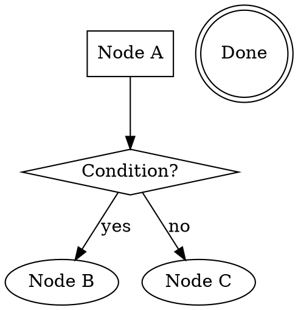

# Skill Workflow Engine 设计文档

## 概述

将 superpowers 风格的 skill（markdown 定义的结构化工作流）编译为可执行的图结构，由增强后的 GraphEngine 执行。同时统一 agent 间通信协议，明确各协作机制的边界。

## 目标

1. 加载 superpowers skill 文件后直接执行其定义的工作流（checklist、process flow、条件分支）
2. 支持 5 种多智能体协作模式：Router、Orchestrator-Worker、Pipeline、Fan-out、Hierarchical
3. 统一结构化消息协议（AgentMessage / AgentResponse）
4. 各协作机制边界清晰，无重叠

## 协作机制边界

每种机制只做一件事，LLM 不存在"该用哪个"的困惑：

| 机制 | 唯一职责 | 使用者 |
|------|----------|--------|
| **Handoff TRANSFER** | 永久控制转移（Router 模式） | LLM 决定："这事不归我管，交给 B" |
| **Delegate tool** | 调用 agent 并返回结果（Orchestrator-Worker） | LLM 决定："我需要 B 帮忙，拿到结果我继续" |
| **图的边** | 预定义的步骤流转（Pipeline、Skill 工作流） | 引擎按图自动执行，LLM 不参与 |
| **并行节点** | 多步骤并发执行（Fan-out） | 引擎并行执行，LLM 不参与 |
| **子图节点** | 嵌套另一个 skill/工作流（Hierarchical） | 引擎递归执行，LLM 不参与 |

5 种协作模式与机制的映射：

- **Router**：Handoff TRANSFER
- **Orchestrator-Worker**：Delegate tool（单次或多次调用）
- **Pipeline**：图的边（A → B → C 顺序连接）
- **Fan-out / Fan-in**：并行节点 或 parallel_delegate 工具
- **Hierarchical**：子图节点（SubgraphNode）+ 可配置的 delegate 深度

## 整体数据流

```
SKILL.md
  → SkillManager.activate()       # 已有：发现、加载 skill 内容
  → SkillParser.parse()            # 新增：解析 markdown → WorkflowPlan
  → WorkflowCompiler.compile()     # 新增：WorkflowPlan → CompiledGraph
  → GraphEngine.run()              # 增强：并行、条件边、子图
  → GraphResult → AgentResponse    # 统一输出
```

## 模块分层

```
Layer 0（无外部依赖）:
  src/graph/messages.py    — AgentMessage, AgentResponse, ResponseStatus
  src/graph/workflow.py    — WorkflowStep, WorkflowTransition, WorkflowPlan, StepType
  src/graph/types.py       — Edge 增加 condition 字段
  src/graph/engine.py      — GraphEngine 增强（并行执行、条件边）
  src/graph/nodes.py       — DecisionNode, SubgraphNode, TerminalNode（新增节点类型）

Layer 2（依赖 Layer 0-1）:
  src/skills/parser.py     — SkillParser（扩展现有 parser）
  src/skills/compiler.py   — WorkflowCompiler（新增）
  src/tools/delegate.py    — DelegateToolProvider 改造

Layer 3（应用层）:
  src/app/app.py           — _handle_skill() 改造
  config.yaml              — 新增深度限制配置
```

---

## 1. 结构化消息协议

设计目标：强制发送方把需求描述清楚，提高接收方执行成功率。沿用现有 delegate 的
4 字段协议（objective / task / context / expected_result），将其提升为所有 agent
间通信的统一标准。

### 1.1 AgentMessage

agent 间通信的统一输入。4 个语义字段强制发送方回答 WHY / WHAT / WITH / EXPECT：

```python
# src/graph/messages.py
import uuid

@dataclass
class AgentMessage:
    objective: str                                      # WHY：最终目标（为什么需要这次协作）
    task: str                                           # WHAT：具体任务（需要对方做什么）
    context: dict[str, Any] | str = ""                  # WITH：已知的相关信息（结构化 dict 或自然语言）
    expected_result: str | None = None                  # EXPECT：期望对方返回什么（对齐输出预期）
    sender: str | None = None                           # FROM：发送方 agent 名称
    message_id: str = field(default_factory=lambda: uuid.uuid4().hex[:12])  # 唯一标识，用于关联请求与响应
```

与现有 delegate schema 的字段一一对应：

| AgentMessage 字段 | 现有 delegate schema | 描述 |
|---|---|---|
| `objective` | `objective` — "你的最终目标是什么（为什么需要这次委托）" | 必填 |
| `task` | `task` — "你需要对方具体做什么" | 必填 |
| `context` | `context` — "当前已知的相关信息。只填你确定知道的，不要猜测。" | 可选 |
| `expected_result` | `expected_result` — "你期望对方完成后告诉你什么" | 可选 |

### 1.2 接收方模板

沿用现有 `RECEIVING_TEMPLATE` 的设计，将 `AgentMessage` 格式化为接收方 prompt：

```python
RECEIVING_TEMPLATE = (
    "你收到了一个委托任务：\n"
    "最终目标：{objective}\n"
    "具体任务：{task}\n"
    "{context_line}"
    "{expected_result_line}"
    "\n"
    "完成后请按以下格式返回：\n"
    "第一行标注任务状态：已完成 / 信息不足 / 失败\n"
    "之后是具体结果或需要补充的信息。\n"
    "不要猜测或假设缺失的信息。"
)

def format_for_receiver(message: AgentMessage) -> str:
    """将 AgentMessage 格式化为接收方的 prompt 输入。"""
    context_line = ""
    if message.context:
        ctx = message.context if isinstance(message.context, str) else json.dumps(message.context, ensure_ascii=False)
        context_line = f"相关上下文：{ctx}\n"
    expected_line = f"期望结果：{message.expected_result}\n" if message.expected_result else ""
    return RECEIVING_TEMPLATE.format(
        objective=message.objective,
        task=message.task,
        context_line=context_line,
        expected_result_line=expected_line,
    )
```

Handoff 和 Delegate 的接收方都使用此模板，确保消息格式一致。

### 1.3 AgentResponse

agent 间通信的统一输出。`status` 对应现有模板要求的 "已完成 / 信息不足 / 失败"：

```python
class ResponseStatus(Enum):
    COMPLETED = "completed"       # 已完成
    FAILED = "failed"             # 失败
    NEEDS_INPUT = "needs_input"   # 信息不足

@dataclass
class AgentResponse:
    text: str                                           # 人类可读的结果文本
    data: dict[str, Any] = field(default_factory=dict)  # 结构化结果数据
    status: ResponseStatus = ResponseStatus.COMPLETED
    sender: str | None = None                           # 响应方 agent 名称
    message_id: str = ""                                # 对应 AgentMessage.message_id，关联请求与响应
```

### 1.4 工具 schema 生成

delegate 和 handoff 的工具 schema 都从 `AgentMessage` 字段自动生成，保持一致：

```python
def build_message_schema() -> dict:
    """生成 AgentMessage 对应的 JSON Schema，供工具 schema 复用。"""
    return {
        "type": "object",
        "properties": {
            "objective": {
                "type": "string",
                "description": "你的最终目标是什么（为什么需要这次协作）",
            },
            "task": {
                "type": "string",
                "description": "你需要对方具体做什么",
            },
            "context": {
                "type": "string",
                "description": "当前已知的相关信息。只填你确定知道的，不要猜测。",
            },
            "expected_result": {
                "type": "string",
                "description": "你期望对方完成后告诉你什么。如果不确定，可简要描述即可。",
            },
        },
        "required": ["objective", "task"],
    }
```

`DelegateToolProvider.get_schemas()` 和 handoff 工具的 schema 生成都调用
`build_message_schema()`，确保字段定义和描述完全一致。

### 1.5 与现有类型的关系

- `AgentResult`（runner 内部返回类型）改为持有 `AgentResponse`：
  ```python
  @dataclass
  class AgentResult:
      response: AgentResponse          # 取代原来的 text + data
      handoff: HandoffRequest | None   # 保留
  ```
- `HandoffRequest` 使用 `AgentMessage`：
  ```python
  @dataclass
  class HandoffRequest:
      target: str
      message: AgentMessage            # 取代原来的 task: str
  ```
- `NodeResult.output` 改为 `AgentResponse`（或兼容 dict 结构）
- `RunContext.input` 改为 `AgentMessage`
- `AgentResponse` 提供工厂方法从 `GraphResult` 转换：
  ```python
  @classmethod
  def from_graph_result(cls, result: GraphResult) -> "AgentResponse":
      output = result.output
      if isinstance(output, AgentResponse):
          return output
      # 兼容旧的 dict 格式
      return cls(
          text=output.get("text", ""),
          data=output.get("data", {}),
      )
  ```

---

## 2. Skill 解析——SkillParser

### 2.1 需要解析的结构

superpowers skill markdown 包含以下可提取的结构：

**Checklist**（主执行序列）：
```markdown
1. **Explore project context** — check files, docs, recent commits
2. **Ask clarifying questions** — one at a time
3. **Propose 2-3 approaches** — with trade-offs
```

**Dot process flow**（执行拓扑）：


**详细 sections**：markdown heading 对应的段落，通过名称匹配关联到步骤，作为该步骤的执行指令。

**全局约束**：`Key Principles`、`Anti-Pattern`、`Hard Gate` 等 section，注入每个节点的 prompt 上下文。

**Skill 转换**：`"Invoke X skill"` 模式 → 标记为 SUBWORKFLOW 类型。

### 2.2 解析优先级

1. **如果有 dot graph** → 以 dot graph 为权威拓扑（表达条件分支和循环）
2. **checklist 作为补充** → 匹配步骤名到 dot 节点，提供描述
3. **如果只有 checklist 没有 dot** → 退化为线性序列
4. **如果两者都没有** → fallback 为单步骤工作流（整个 body 作为一个 ACTION）

### 2.3 输出模型

```python
# src/graph/workflow.py

class StepType(Enum):
    ACTION = "action"            # box → 执行具体工作
    DECISION = "decision"        # diamond → LLM 评估条件选择分支
    TERMINAL = "terminal"        # doublecircle → 工作流结束点
    SUBWORKFLOW = "subworkflow"  # 调用另一个 skill 的工作流

@dataclass
class WorkflowStep:
    id: str                              # 唯一标识
    name: str                            # 步骤名称
    instructions: str                    # 该步骤的详细指令（从对应 section 提取）
    step_type: StepType                  # 节点类型
    subworkflow_skill: str | None = None # step_type=SUBWORKFLOW 时，要调用的 skill 名

@dataclass
class WorkflowTransition:
    from_step: str
    to_step: str
    condition: str | None = None         # None=无条件, "yes"/"no"/自定义标签

@dataclass
class WorkflowPlan:
    name: str
    steps: list[WorkflowStep]
    transitions: list[WorkflowTransition]
    entry_step: str
    constraints: list[str]               # 全局约束/原则，注入每个节点
```

---

## 3. GraphEngine 增强

### 3.1 并行节点执行

当 `pending` 队列有多个互相无依赖的节点时，使用 `asyncio.gather` 并行执行：

```python
if len(pending) > 1:
    tasks = [self._execute_node(graph, name, context) for name in pending]
    results = await asyncio.gather(*tasks)
    for name, result in zip(pending, results):
        self._write_state(name, result, context)
    last_output = self._merge_parallel_outputs(results)
else:
    # 单节点，保持当前逻辑
```

并行节点共享 `RunContext`，各节点写入不同的 state key（已有 `_write_state` 按节点名写入）。`context.input` 在并行场景下是只读的。

并行输出合并策略：将各节点的 `AgentResponse` 合并为一个，`text` 拼接（按节点名分隔），`data` 按节点名为 key 聚合：

```python
def _merge_parallel_outputs(self, names: list[str], results: list[NodeResult]) -> AgentResponse:
    texts = [f"[{name}] {r.output.text}" for name, r in zip(names, results)]
    data = {name: r.output.data for name, r in zip(names, results)}
    return AgentResponse(text="\n".join(texts), data=data)
```

### 3.2 条件边

`Edge` 增加 `condition` 字段：

```python
@dataclass
class Edge:
    from_node: str
    to_node: str
    condition: str | None = None  # None=无条件
```

条件边**仅出现在 DecisionNode 之后**。DecisionNode 执行后产出 `chosen_branch`，引擎直接匹配，不需要额外 LLM 调用：

```python
def _resolve_edges(self, node_name, node_result, context, edges):
    candidates = [e for e in edges if e.from_node == node_name]
    if not candidates:
        return []

    unconditional = [e for e in candidates if e.condition is None]
    conditional = [e for e in candidates if e.condition is not None]

    if conditional:
        # 直接匹配 DecisionNode 的 chosen_branch，无需 LLM 调用
        chosen_branch = node_result.output.data.get("chosen_branch", "")
        matched = [e for e in conditional if e.condition == chosen_branch]
        if not matched:
            # fallback：如果没有精确匹配，取第一条条件边
            logger.warning(f"No exact branch match for '{chosen_branch}', using first conditional edge")
            matched = [conditional[0]]
        return [e.to_node for e in matched]

    return [e.to_node for e in unconditional]
```

### 3.3 新增节点类型

**DecisionNode**：LLM 评估条件，选择分支。

```python
class DecisionNode:
    """LLM 评估条件，选择分支"""
    question: str              # 决策问题
    branches: list[str]        # 可选分支标签

    async def execute(self, context: RunContext) -> NodeResult:
        prompt = f"""Based on the current state, choose the next action.

Current state: {context.input}
Options: {self.branches}

Reply with ONLY the chosen option label."""

        choice = await llm.complete(prompt)
        return NodeResult(
            output=AgentResponse(text=choice.strip(), data={"chosen_branch": choice.strip()}),
        )
```

引擎根据 `NodeResult.output.data["chosen_branch"]` 匹配条件边，决定下一节点。

**SubgraphNode**：嵌套执行另一个编译好的图。

```python
class SubgraphNode:
    """嵌套执行子图"""
    sub_graph: CompiledGraph

    async def execute(self, context: RunContext) -> NodeResult:
        sub_ctx = RunContext(
            input=context.input,
            state=DynamicState(),
            deps=context.deps,
            depth=context.depth + 1,
        )
        result = await context.deps.engine.run(self.sub_graph, sub_ctx)
        return NodeResult(output=AgentResponse.from_graph_result(result))
```

**TerminalNode**：标记工作流结束，将上一步的输出透传为最终结果。

```python
class TerminalNode:
    async def execute(self, context: RunContext) -> NodeResult:
        # 从 state 中获取上一步的输出作为最终结果
        last_response = context.state.get("_last_output", AgentResponse(text="", data={}))
        return NodeResult(output=last_response)
```

### 3.4 深度限制

统一的可配置深度控制：

```yaml
# config.yaml
agents:
  max_handoff_depth: 5      # Handoff TRANSFER 深度
  max_delegate_depth: 3     # Delegate 嵌套深度
  max_parallel_width: 5     # 并行节点数上限
  max_subgraph_depth: 3     # 子图嵌套深度
```

所有深度检查在引擎层统一执行。

---

## 4. Delegate 增强

### 4.1 改造要点

- 内部改为通过引擎执行（不再直接调 `runner.run()`）
- 使用结构化消息协议（AgentMessage / AgentResponse）
- 深度限制改为可配置

### 4.2 执行流程

```python
class DelegateToolProvider:
    async def execute(self, name: str, args: dict, context: RunContext) -> str:
        agent_name = name.removeprefix(DELEGATE_PREFIX)

        # 1. 从工具参数构造 AgentMessage（字段与 schema 一一对应）
        message = AgentMessage(
            objective=args.get("objective", args.get("task", "")),
            task=args["task"],
            context=args.get("context", ""),
            expected_result=args.get("expected_result"),
            sender=context.current_agent_name,
        )

        # 2. 构建单节点子图（仅包含目标 agent 一个节点，无边）
        agent = self.registry.get(agent_name)
        sub_graph = GraphBuilder().add_node(agent_name, AgentNode(agent)).set_entry(agent_name).build()

        # 3. 通过引擎执行（接收方通过 format_for_receiver(message) 获得格式化 prompt）
        sub_ctx = RunContext(
            input=message,
            state=DynamicState(),
            deps=context.deps,
            depth=context.depth + 1,
        )
        result = await self.engine.run(sub_graph, sub_ctx)

        # 4. 返回结构化响应
        response = AgentResponse.from_graph_result(result)
        context.state[f"delegate_{agent_name}"] = response.data
        return response.text

    def get_schemas(self) -> list[ToolDict]:
        """复用 build_message_schema() 生成统一的 4 字段 schema。"""
        schemas = []
        for summary in self._resolver.get_all_summaries():
            name, desc = summary["name"], summary["description"]
            schemas.append({
                "type": "function",
                "function": {
                    "name": f"{DELEGATE_PREFIX}{name}",
                    "description": DELEGATE_DESCRIPTION_TEMPLATE.format(description=desc),
                    "parameters": build_message_schema(),
                },
            })
        return schemas
```

### 4.3 并行 Delegate

新增 `parallel_delegate` 工具，支持扇出：

```python
# LLM 调用示例
parallel_delegate(tasks=[
    {"agent": "file_agent", "task": "列出 src/ 下的文件", "context": {}},
    {"agent": "git_agent", "task": "获取最近 5 次提交", "context": {}},
])
```

内部用 `asyncio.gather` 并行执行多个单节点子图，返回合并结果。

---

## 5. WorkflowCompiler

### 5.1 编译规则

| WorkflowStep 类型 | 编译为 |
|---|---|
| `ACTION` | `AgentNode`：步骤 instructions + 全局 constraints 作为 agent prompt |
| `DECISION` | `DecisionNode`：LLM 评估条件，选择分支 |
| `TERMINAL` | `TerminalNode`：标记结束 |
| `SUBWORKFLOW` | `SubgraphNode`：加载目标 skill → 解析 → 编译 → 子图执行 |

### 5.2 编译流程

```python
# src/skills/compiler.py

class WorkflowCompiler:
    def compile(self, plan: WorkflowPlan,
                skill_manager: SkillManager,
                agent_factory: Callable[[str, str], Agent]) -> CompiledGraph:
        graph = GraphBuilder()

        for step in plan.steps:
            match step.step_type:
                case StepType.ACTION:
                    agent = agent_factory(step.id, step.instructions)
                    graph.add_node(step.id, AgentNode(agent))

                case StepType.DECISION:
                    branches = [t.condition for t in plan.transitions
                                if t.from_step == step.id and t.condition]
                    graph.add_node(step.id, DecisionNode(
                        question=step.instructions,
                        branches=branches,
                    ))

                case StepType.SUBWORKFLOW:
                    sub_plan = self._load_and_parse_skill(
                        step.subworkflow_skill, skill_manager
                    )
                    sub_graph = self.compile(sub_plan, skill_manager, agent_factory)
                    graph.add_node(step.id, SubgraphNode(sub_graph))

                case StepType.TERMINAL:
                    graph.add_node(step.id, TerminalNode())

        for t in plan.transitions:
            graph.add_edge(Edge(
                from_node=t.from_step,
                to_node=t.to_step,
                condition=t.condition,
            ))

        graph.set_entry(plan.entry_step)
        return graph.build()
```

### 5.3 agent_factory

每个 ACTION 步骤创建一个轻量级"步骤 agent"：

```python
def make_step_agent(step_id: str, instructions: str) -> Agent:
    return Agent(
        name=f"step_{step_id}",
        instructions=instructions,
        model=default_model,
        handoffs=[],
        # 步骤 agent 继承全局 tool_router 的所有工具（通过 deps 传递）
        # 不包含 handoff 工具（步骤间流转由图的边控制）
        # 包含 delegate 工具（步骤内仍可调用其他 agent）
    )
```

### 5.4 与 PlanCompiler 的关系

两者并列，不互相依赖：

- `PlanCompiler`：`Plan`（工具/agent 步骤 + 依赖） → `CompiledGraph`，侧重并行分组
- `WorkflowCompiler`：`WorkflowPlan`（skill 结构） → `CompiledGraph`，侧重条件分支和子图

两者产出相同的 `CompiledGraph`，由相同的 `GraphEngine` 执行。

---

## 6. 集成层

### 6.1 `_handle_skill()` 改造

```python
async def _handle_skill(self, skill_name: str, user_input: str):
    # 1. 激活 skill
    content = self.skill_manager.activate(skill_name)

    # 2. 解析 → WorkflowPlan
    parser = SkillParser()
    workflow = parser.parse(content)

    # 3. 编译 → CompiledGraph
    compiler = WorkflowCompiler()
    graph = compiler.compile(workflow, self.skill_manager, self._make_step_agent)

    # 4. 构建 RunContext
    context = RunContext(
        input=AgentMessage(task=user_input, context={}),
        state=DynamicState(),
        deps=self.deps,
    )

    # 5. 引擎执行
    result = await self.engine.run(graph, context)

    # 6. 输出
    response = AgentResponse.from_graph_result(result)
    await self.ui.display(response.text)
```

### 6.2 fallback 策略

如果 skill markdown 没有 checklist 也没有 dot graph，`SkillParser.parse()` 返回单步骤 WorkflowPlan：

```python
WorkflowPlan(
    name=skill_name,
    steps=[WorkflowStep(
        id="main",
        name=skill_name,
        instructions=full_body,
        step_type=StepType.ACTION,
    )],
    transitions=[],
    entry_step="main",
)
```

所有 skill 通过统一路径执行。

### 6.3 配置

```yaml
# config.yaml
agents:
  max_handoff_depth: 5
  max_delegate_depth: 3
  max_parallel_width: 5
  max_subgraph_depth: 3
```

---

## 7. 影响范围

### 新增文件

| 文件 | 内容 |
|------|------|
| `src/graph/messages.py` | AgentMessage, AgentResponse, ResponseStatus |
| `src/graph/workflow.py` | WorkflowStep, WorkflowTransition, WorkflowPlan, StepType |
| `src/graph/nodes.py` | DecisionNode, SubgraphNode, TerminalNode |
| `src/skills/compiler.py` | WorkflowCompiler |

### 修改文件

| 文件 | 改动 |
|------|------|
| `src/graph/engine.py` | 并行执行、条件边评估 |
| `src/graph/types.py` | Edge 增加 condition 字段 |
| `src/agents/agent.py` | AgentResult 持有 AgentResponse，HandoffRequest 使用 AgentMessage |
| `src/agents/runner.py` | 适配 AgentMessage/AgentResponse |
| `src/tools/delegate.py` | 走引擎执行、结构化消息、parallel_delegate |
| `src/skills/parser.py` | 扩展：解析 checklist、dot graph、sections |
| `src/app/app.py` | _handle_skill() 改造 |
| `config.yaml` | 新增深度限制配置 |

### 不变文件

| 文件 | 原因 |
|------|------|
| `src/skills/manager.py` | 发现/激活逻辑不变 |
| `src/skills/provider.py` | activate_skill 工具不变 |
| `src/plan/flow.py` | PlanFlow 独立，不受影响 |
| `src/plan/compiler.py` | PlanCompiler 独立，不受影响 |
| `src/graph/builder.py` | GraphBuilder 接口不变（内部可能需要适配新 Edge） |
